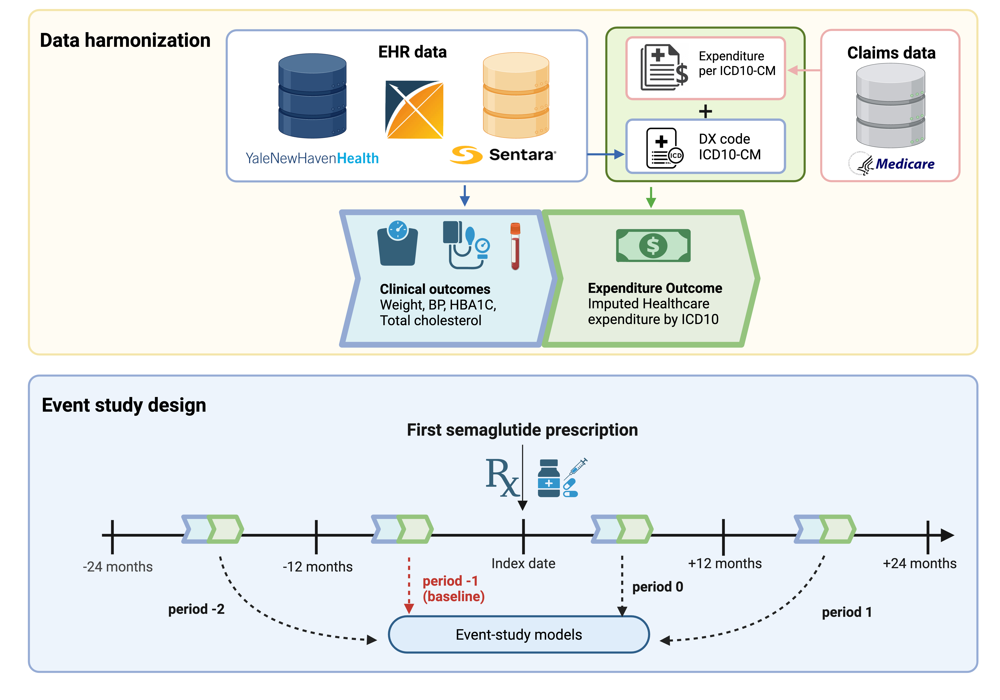

# Changes in Cardiovascular Risk Factors and Healthcare Expenditure Among Patients Prescribed Semaglutide

**Authors:** Yuan Lu¹,²,³, Yuntian Liu²,³, Tedi Totojani⁴, Chungsoo Kim¹,², Rohan Khera¹,², Hua Xu³, John Brush⁵,⁶, Harlan Krumholz¹,²,⁷, Jason Abaluck⁴,⁸

**Affiliations:**
1. Section of Cardiovascular Medicine, Department of Internal Medicine, Yale School of Medicine
2. Center for Outcomes Research and Evaluation, Yale New Haven Hospital
3. Department of Biomedical Informatics and Data Sciences, Yale School of Medicine
4. Yale School of Management
5. Sentara Health
6. Macon & Joan Brock Virginia Health Sciences at Old Dominion University
7. Department of Health Policy and Management, New Haven, CT.
8. National Bureau of Economic Research

This is the code repository for the research project "Changes in Cardiovascular Risk Factors and Healthcare Expenditure Among Patients Prescribed Semaglutide," which uses electronic health record (EHR) data from Yale New Haven Hospital System (YNHHS) and Sentara Health to investigate the real-world impact of semaglutide prescription initiation. The paper has been accepted by JAMA Network Open and will be published online soon.

## ABSTRACT

**IMPORTANCE:** Semaglutide, a glucagon-like peptide-1 receptor agonist, has demonstrated substantial weight reduction and cardiovascular benefits in clinical trials. However, its real-world impact on clinical outcomes and healthcare expenditures remains underexplored.

**OBJECTIVE:** To evaluate changes in cardiovascular risk factors and healthcare expenditures among patients prescribed semaglutide across multicenter cohorts.

**DESIGN, SETTING, AND PARTICIPANTS:** This retrospective cohort study included adults (≥18 years) who received an initial semaglutide prescription between January 2018 and January 2025 at Sentara Healthcare and May 2025 Yale New Haven Health System. A staggered difference-in-differences design compared outcomes following the first semaglutide prescription with those of patients who had not yet received their prescription during the same period.

**EXPOSURES:** The first prescription of semaglutide identified at the ingredient level, stratified by type 2 diabetes status.

**MAIN OUTCOMES AND MEASURES:** Primary outcomes included changes in weight (% baseline), blood pressure (BP), total cholesterol, and glycated hemoglobin (HbA1c). Secondary outcomes assessed healthcare expenditures using Medicare-based cost estimates.

**RESULTS:** The study cohort included 23,522 patients (mean age 56.2 years; 66.7% female; 68.6% with diabetes). In the overall cohort, initiating semaglutide prescription was significantly associated with a -3.79% (95% CI, -3.93% to -3.65%) reduction in weight at 13–24 months, with a -5.12% (95% CI, -5.49% to -4.74%) among patients without diabetes. Significant reductions in diastolic BP (-1.51 mmHg; 95% CI, -1.68 to -1.35), systolic BP (-1.09 mmHg; 95% CI, -1.36 to -0.81), and total cholesterol (-12.81 mg/dL; 95% CI, -14.25 to -11.37) were also observed. HbA1c reductions were greater in patients with diabetes (-0.27%; 95% CI, -0.32% to -0.22%) compared with patients without diabetes (-0.08%; 95% CI, -0.15% to -0.01%). Imputed healthcare expenditures, excluding the cost of semaglutide, increased by $80/month (95% CI, $68 to $92) during the 13–24-month period, driven by inpatient stays shifting to more expensive circulatory and metabolic diagnoses.

**CONCLUSIONS AND RELEVANCE:** In this cohort study of adults prescribed semaglutide, initiation was associated with reductions in weight and cardiovascular risk factors but increases in healthcare expenditures excluding semaglutide costs. These findings suggest potential clinical benefits in routine practice, while highlighting the need to evaluate the long-term economic impact of semaglutide use.
